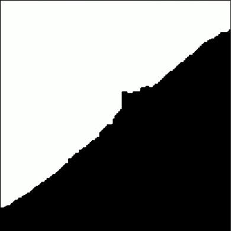
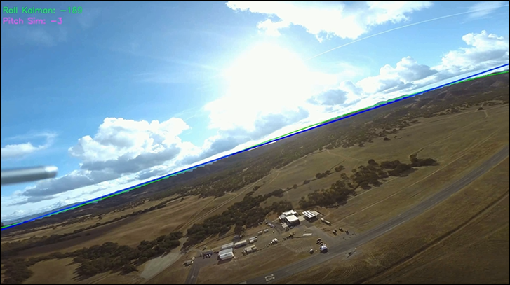

#  Horizon Detector and Roll/Pitch Extractor

##  프로젝트 개요

이 프로젝트는 사전 학습된 **SegFormer-b1** 모델을 활용하여 1인칭 영상 속 하늘 마스크를 생성하고, 
추출된 마스크의 수평선 경계를 분석하여 영상의 모션 데이터(**Roll** 및 **Pitch**)를 추정하고 
3-DoF 시뮬레이터에 연동 가능한 형식으로 저장한 후 시각화하는 프로젝트입니다.

### 주요 기능

* **하늘 마스킹:** SegFormer 모델과 Optical Flow 기반 후처리를 통해 가려진 영역을 복원하며 하늘 마스크를 생성합니다.
* **모션 데이터 계산:** 추출된 하늘 마스크의 경계선에 **3차 다항식 피팅** 및 **선형 회귀**를 적용하여 수평선을 추정하고 모션 데이터를 계산합니다.
* **데이터 출력 및 시각화:** 처리된 모션 데이터를 시뮬레이더에 연동 가능한 형식의 엑셀(`.xlsx`) 파일로 저장하고, 그래프(`.png`)를 생성합니다.

### 하늘 마스크 생성 예시



### 수평선 추정 및 모션 데이터 계산 예시



---

## 파일 구조

###  프로젝트 구조

````
프로젝트_루트/
├── HorizonDetector/
│   ├── draw_graph.py         # 엑셀 데이터(.xlsx)를 읽어 그래프(.png)로 생성
│   ├── horizon_detector.py   # 메인 로직: 영상 처리, Roll/Pitch 계산, 엑셀 출력
│   └── sky_mask.py           # SegFormer 모델 기반 하늘 마스킹 및 후처리
├── inputs/                   # 원본 영상 파일 저장 위치
├── outputs/                  # 결과물 저장 위치
├── requirements.txt          # 프로젝트 필수 라이브러리 목록
````

### 입출력 폴더

````
* ../inputs/  : 원본 영상 파일 저장 위치
* ../outputs/ : 결과물 저장 위치
    * videos/ : 수평선 및 모션 데이터 정보가 오버레이된 결과 영상 
    * xlsx/   : 모션 데이터 엑셀 파일 (`.xlsx`)
    * graph/  : 모션 데이터 그래프 이미지 (`.png`)

````

## 설치 및 실행 방법

### 1. 환경 설정

`requirements.txt` 파일을 사용하여 필요한 모든 Python 라이브러리를 설치합니다.

```bash
pip install -r requirements.txt
````

### 2. 실행 방법

1.  **원본 영상 준비:** 처리할 영상 파일들을 **`../inputs/`** 폴더에 복사합니다.

2. **스크립트 실행:** `horizon_detector.py`를 실행합니다.

<!-- end list -->

```bash
python HorizonDetector/horizon_detector.py
```

### 3. 사용자 입력

실행 중 다음과 같은 입력이 필요합니다.

1.  **영상 환경 선택:** 영상의 환경에 맞춰 하늘을 가리는 객체 복원 유형을 선택합니다.
      * `1`: 드론/비행기
      * `2`: 레이싱
      * `3`: 보트

2.  **Pitch Scale 입력:** Pitch 데이터의 민감도를 조정할 배율을 입력합니다. (기본값: 200)

### 4. 결과 확인

스크립트 실행이 완료되면, 모든 영상 처리와 엑셀 저장이 완료됩니다.

그래프 이미지를 생성하려면, 다음 명령어를 실행합니다.
```bash
python HorizonDetector/draw_graph.py
```
결과물은 **`../outputs/`** 폴더 내 각 하위 폴더에 저장됩니다.


-----

##  주요 기술 스택

| 분류 | 기술 | 역할 |
| :--- | :--- | :--- |
| **딥러닝** | PyTorch, Hugging Face Transformers (SegFormer) | 영상의 **하늘 영역** Semantic Segmentation |
| **컴퓨터 비전** | OpenCV (cv2) | 비디오 I/O, Kalman Filter, 광학 흐름(Optical Flow), 윤곽선(Contour) 분석 |
| **데이터 처리** | NumPy, SciPy | 3차 다항식/선형 회귀, 보간, 필터링 |
| **출력/시각화** | openpyxl, pandas, matplotlib | Roll/Pitch 데이터 엑셀 저장 및 그래프 자동 생성 |

```
```